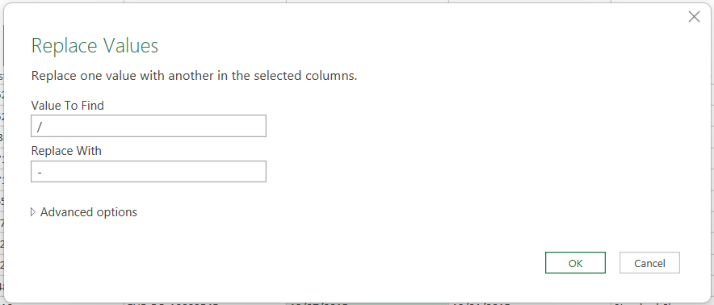

## Objective & Overview
This document walk through on what data modeling & wrangling process I performed on the dataset before importing it on local postgre database. The data cleaning & modeling process were necessary to avoide issues in data importing process and make the dataset suitable for *Exploratory Data Analysis* and *Data Visualization*. 

#### Following are the steps I take to clean & model the raw dataset.

1. **Data Importation In Power Query Editor** 
- Opened a blank Excel file that named as `Cleaning + Modeling' and launch power query editor in it. 
- Import [raw_sales_dataset](0_resources\raw_sales_dataset.csv) into the power query editor.

2. **Fact & Dimension Table Creation**
- Created five duplicate table and named them as following:
    - `Fact_Sale`
    - `Dim_Customer`
    - `Dim_Product`
    - `Dim_Date`
    - `Dim_Shipping`
- Kept the relevant columns in each table as following
    - `Fact_Sale`: *Order_ID, Customer_ID, Product_ID, Date_ID, Ship_ID, Sales, Quantity, Discount, Profit.*
    - `Dim_Customer`: *Customer_ID, Customer_Name, Segment, City, State, Postal_Code, Region.*
    - `Dim_Product`: *Product_ID, Product_Name, Category.*
    - `Dim_Date`: *Order_Date*
    - `Dim_Shipping`: *Ship_Date, Ship_Mode.*
- Removed duplicate records by unique value column from all tables.
> Found 1 duplicate transaction in Fact_Sale table.

3. **Date Format Standardization**
- Found inconsistent saparators and incorrect data format that are cousing data type issue while importing to SQL.
- Took following steps to fix the issue.
- Used 'Replace Value' function to fix inconsistent saparator(`06-15-2016` & `06/15/2016`) by replacing the splash(/) with hypen(-).


- Created new custom columns as `Order Date Fixed` & `Ship Date Fixed` to fix the incorrect date format issue (`MM-DD-YYYY`→ `DD-MM-YYYY`) with with following formula:
    ```M
    let
    SplitDate = Text.Split([Order Date], "-"),
    MonthPart = Text.PadStart(SplitDate{0}, 2, "0"),
    DayPart = Text.PadStart(SplitDate{1}, 2, "0"),
    YearPart = SplitDate{2}
    in
    DayPart & "-" & MonthPart & "-" & YearPart
    ```
4. **Synthetic Primary Key's Creation**
- Existing dataset lack of id columns for `Dim_Date` & `Dim_Shipping` table.
- Custom id column are created in order to join these two tables with `Fact_Sale` table using the following formula:
    ```M

    ```
- Joined the `Fact_Sale` table with `Dim_Date` on *Order Date* column using 'Merge Query' function.
- Expand the `Dim_Date` table and only keep *Date ID* column then removed the *Order Date* column from `Fact_Sale` table.
- Repeated the same process with `Dim_Shipping` to create primary key and add it to `Fact_Sale` table through 'Merge Query' function.

5. **Data Importation to SQL Database**
- One by one table importaed through pgAdmin's PSQL tool using the following command lines:
    ```SQL
    -- Import data to Dim_Customer
    \copy Dim_Customer FROM 'C:\Users\Rohan Thorat\Documents\Portfolio Projects\Profit_Margin_Analysis\0_resources\Dim_Customer.csv' DELIMITER ',' CSV HEADER;

    -- Import data to Dim_Product
    \copy Dim_Product FROM 'C:\Users\Rohan Thorat\Documents\Portfolio Projects\Profit_Margin_Analysis\0_resources\Dim_Product.csv' DELIMITER ',' CSV HEADER;

    -- Import data to Dim_Date
    \copy Dim_Date FROM 'C:\Users\Rohan Thorat\Documents\Portfolio Projects\Profit_Margin_Analysis\0_resources\Dim_Date.csv' DELIMITER ',' CSV HEADER;

    -- Import data to Dim_Shipping
    \copy Dim_Shipping FROM 'C:\Users\Rohan Thorat\Documents\Portfolio Projects\Profit_Margin_Analysis\0_resources\Dim_Shipping.csv' DELIMITER ',' CSV HEADER;

    -- Import data to Fact_Sale
    \copy Fact_Sale FROM 'C:\Users\Rohan Thorat\Documents\Portfolio Projects\Profit_Margin_Analysis\0_resources\Fact_Sale.csv' DELIMITER ',' CSV HEADER;
    ```

6. **Derived Time-Series Columns In `Dim_Date`**
> Forgot to create new time series columns in power query editor, hence created in SQL `Dim_Date` table.
```SQL
-- Create year column
ALTER TABLE Dim_Date
ADD COLUMN Year INT

-- Update year column
UPDATE Dim_Date
SET Year = EXTRACT(YEAR FROM Order_Date)

-- Create quarter column
ALTER TABLE Dim_Date
ADD COLUMN Quarter VARCHAR(5)

-- Update quarter column
UPDATE Dim_Date
SET Quarter = 'Q' || CEIL(EXTRACT(MONTH FROM Order_Date) / 3)

-- Create month column
ALTER TABLE Dim_Date
ADD COLUMN Month INT

-- Update month column
UPDATE Dim_Date
SET Month = EXTRACT(MONTH FROM Order_Date)

-- Create day column
ALTER TABLE Dim_Date
ADD COLUMN Day INT

-- Update day column
UPDATE Dim_Date
SET Day = EXTRACT(DAY FROM Order_Date)

-- Create Week of year column
ALTER TABLE Dim_Date
ADD COLUMN Week_of_Year VARCHAR(5)

-- Update Week of year column
UPDATE Dim_Date
SET Week_of_Year = 'W' || TO_CHAR(Order_Date, 'IW');
```