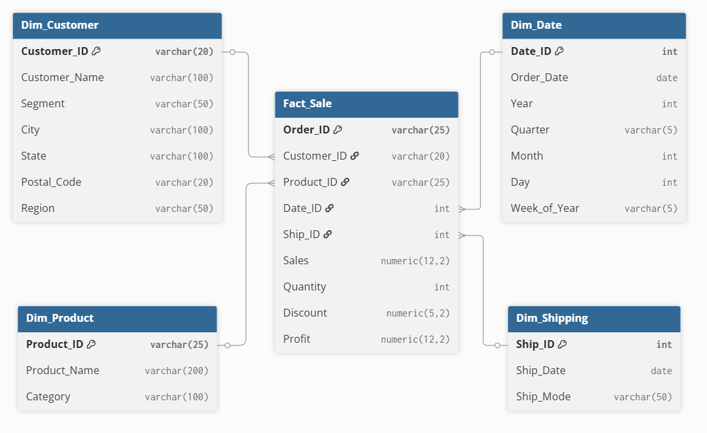
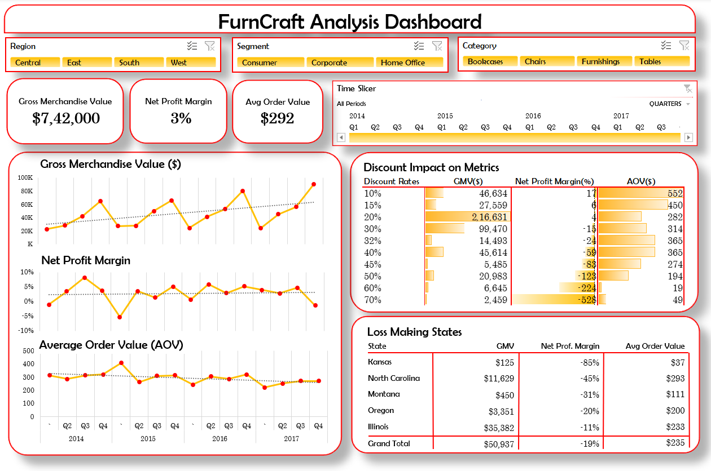
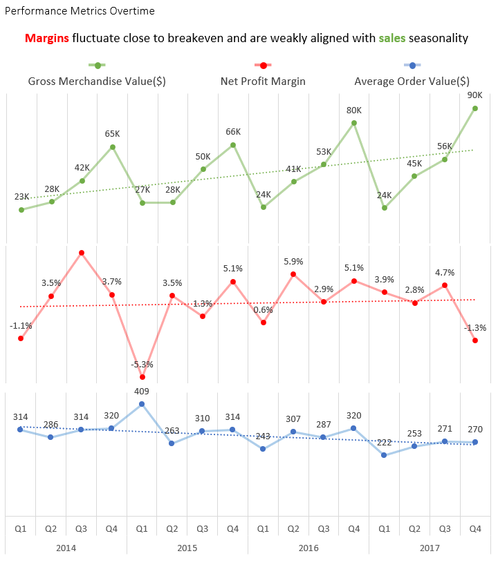
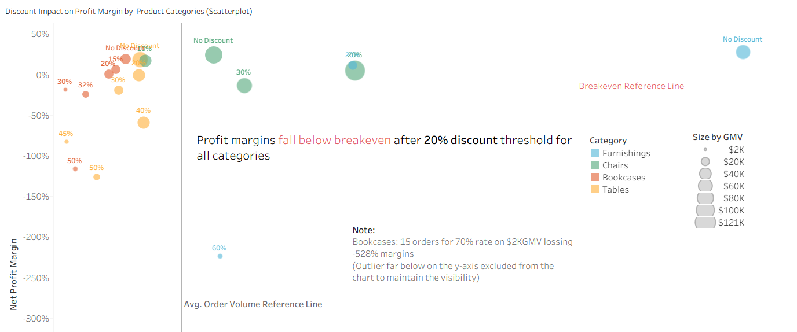
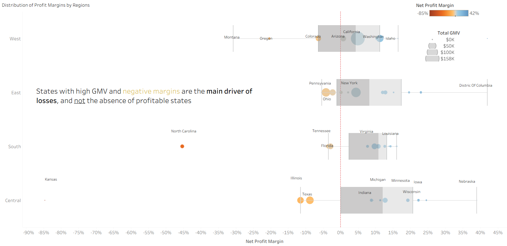
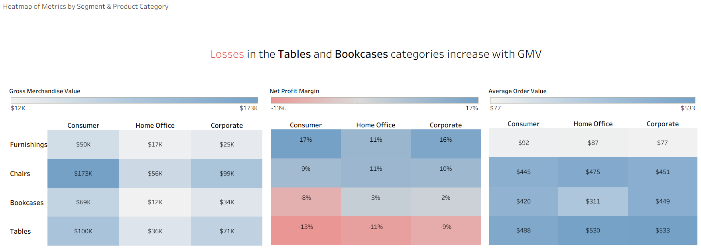

# Project Background
FurniCraft Retails, a furniture retail company selling furniture-related products to thousands of customers throughout the United States since 2014. The company noticed low profit margins despite high sales volume healthy average order value(AOV). The goal of this project is to provide insights & recommendations that may improve the profit margins by analyzing key sales levers, such as discounts,product categories, segments and regions.

Insight & recommendations are provided on the following key areas:
- **Trend Analysis:** Compare GMV, Net profit margin & AOV overtime to analysis how each metrics evolve overtime time and how these react to each other.

- **Discount Impact Analysis:** Analyze the impact all discount rates on GMV, profit margins and order volume to understand which discount rates are driving profit loss. 

- **Regional Distribution Analysis:** Explore the distribution for profit margins across all states and region to understand regional performance.
- **Segment-Category Analysis:** To uncover the trends and patterns on segment level contribution of each product category. 

Documentation for data modeling, cleaning and sql queries to import and inspect data can be found here [link](1_create_sql/data_cleanig.md) .

Targed SQL queries regarding various business questions can be found here [link](2_analysis_quries).

An interactive Excel dashboard used to explore the insights and analyse the patterns can be found here [link](https://1drv.ms/x/c/E96827E6D11B4499/IQBEQirx4iY2R6YFf4zZGNRwAeOKZRDWuZc2DCObrwpIayk?e=C68Cfz)

# Data Structure

The companies main database structure as seen below consists of four tables: Fact_Sale, Dim_Product, Dim_Customer, Dim_Date, Dim_Shipping, with a total row count of 2121 records. A description of each table is as follows:

- **Fact_Sale:** Stores all sales transactions with details like customer, product, date, and profit — useful for analyzing sales performance and business trends.
- **Dim_Product:** Contains product names and categories — helps identify top-selling items and compare product performance.
- **Dim_Customer:** Includes customer info such as name, segment, and location — useful for studying customer behavior and regional sales patterns.
- **Dim_Date:** Holds order dates with year, month, and week info — helps analyze time-based trends and seasonality in sales.
- **Dim_Shipping:** Tracks shipping dates and modes — useful for reviewing delivery performance and shipping efficiency.

# Executive Summary

### Overview of Findings

The overall analysis shows that sales growth has not translated into profitable margins, primarily due to aggressive discounting beyond a viable threshold. Net profit was mostly fragile across years, then turned negative even during the high GMV period. These losses are concentrated in a small number of high GMV states and in the product categories like Tables and Bookcases, which are heavily affected by the discounting strategy.

# Insights Deep Dive
### Trend Analysis:

1. **High GMV failed to protect margins overtime:** From 2014 to 2016, profit margins maintained consistent positive (4-5%) alignment with peak GMV quarters. That relationship breaks in year 2017, profit margin dropped by -1.3% in Q4 which had the highest GMV ($90K) across years. This indicates that the sales growth is no longer translating into marginal profitability in recent years.

2.	**Margins are fragile and operate close to breakeven:** A high share of 0-3% margin quarters indicates that many quarters operate close to breakeven. This causes recurring losses in Q1 in the early years(2014-2016). Eventually escalates into -1.3% of marginal loss even during high GMV periods (2017 Q4).

3.	**AOV fluctuations failed to explain marginal fragility:** Fragile margin quarters are mostly clustered near average trend line. AOV trend not have any strong behavior pattern to support the correlation between customer spending and marginal fragility, except AOV jump of 409 for the lowest profit margin(-5.3%) in Q1 2015. These suggest revenue per order is not the main loss driver here, and margin pressure is coming from elsewhere.

4.	**Profitability erodes outside a viable GMV band:** As per the seasonality, GMV has its lowest at Q1 across years, with that it also has margin loss dip from 2014 to 2016. This alignment point of that the business needs to sell over a certain volume to sustain its operational costs. The opposite behaviour happens in 2017, where profit margin operates at a loss even for the highest GMV quarter (2017 Q4). This behaviour indicates that the profit margins fails below and above a viable GMV range.

### Discount Impact Analysis:

1.	**The business start loosing money after a certain discount threshold:** 20% discount rate is a threshold after which profit margins collapse for all categories. At 30% discount, all categories show -14 to -19% margins. Beyond this level, losses deepen sharply to -500%.

2.	**Losses drastically increase with higher discount rates:** At 40-45% discount rates the margins falls between -50% to -80%, then it fall from -116% to -126% for 50% discount rate. Compared with margins at 50% rate, the margins fall two times lower for 60% discount rate and five times lower for 70% discount rate.

3.	**Discounts drag margins down even with high GMV or order volume:** High GMV and order volume does not translate into profit as applied discounts compress order level margins. Furnishing and Chairs have highest GMV and order volume compared to Bookcases and Tables, despite of that Chairs operate close to breakeven. Furnishing at 60% discount generates a marginal loss of -224% even with higher than average order volume.

4.	**Categories specifically having higher discount rates fall earlier and deeper:** Profit margins deteriorate sharply (-50% to -80%) at ≥40% discount. Extreme discounts (60%-70%) generate low or moderate order volumes, yet losses deepen disproportionately (-224% to -528%). Categories like Bookcases and Tables fail to scale demand at any high discount level, indicating lack of demand over price sensitivity.

### Regional Distribution Analysis:

1. **Most high-GMV states operate at negative or near-breakeven margins:** The majority of top-GMV states (California, New York, Texas, Illinois, Pennsylvania, Florida) operate between –11% to +5% margins. Washington & Virginia are the only exceptions with high GMV and strong margins (>10%). This suggests that the discounting strategy was largely implemented in several states to boost sales.
  
2. **The business does not lack profitable states, but profitable states lack sales volume:** Positive and extreme margins states outnumber negative margins states, but contribute little GMV. Nebraska, Iowa, Wisconsin, and Minnesota show 19–39% margins with GMV below $10K. High-GMV states cluster near breakeven or negative margins.
  
3. **Losses are not systemic and are concentrated in the South & Central regions:** Losses are driven by a few underperforming regions rather than company-wide weakness. In the West, high-GMV states like California ($158K, ~5%) and Washington ($43K, 11%) remain profitable or near breakeven, limiting downside. In contrast, the South and Central regions have high-GMV states below breakeven—such as Texas ($48K, -9%), Illinois ($35K, -11%), Florida ($25K, -3%), and North Carolina ($12K, -45%)—causing losses to concentrate despite the presence of profitable low-GMV states.
  
4. **Margins weakness is driven by underperforming high GMV states than by the lack of profitable states:** Most regions are dominated by negative-margined high-sales states that drag margins down even in the presence of strong margins state. Sales growth in states that has strong margins and established market compared to other small GMV states will help to restore the margins.

### Segment-Category Analysis:

1. **The Tables category is the main driver of losses across all segments:** Despite of having 2nd highest contribution in GMV, Tables failed to protect its margins. Consumer segment lead with -13% loss, followed by Home Office(-10%) and Corporate(-9%). Since Tables unprofitability is not segment-specific but spread across all customer types, suggesting that the Tables SKUs are price-sensitive and dependent on discounts to scale.
  
2. **Growth amplification drags margins down for loss-making categories:** Tables were operating at -9% with $71K in the Corporate segment, then it deteriorated to -13% with $100K in the Consumer segment. Similarly, Bookcases margins were fragile in Home Office & Corporate, then for higher GMV segment like Consumer, it falls to -8%. As GMV grows, margins will only going to get worse for these two categories, as the sales demand was mostly fueled by the discounting strategy.
  
3. **Furnishing leads in profitability even with low GMV and AOV:** Furnishing maintains strong margins across all segments, and margins also grow higher with increasing GMV scale. For Home Office, margin were at 11% for $17K GMV. The margins went up to 16% as GMV grows in the Corporate and Consumer segment. Furnishings have the lowest AOV among all four categories, suggesting that the Furnishing products make their sales with a lower price point. These observations indicate that Furnishings products are least affected by discounts as they already have natural demand across segments.
  
4. **All categories except Furnishings have high AOV regardless of their GMV volume:** Chairs, Bookcases & Tables all show consistently high AOVs. Tables have the highest AOV range ($488–$533), followed by Chairs ($445–$475) and Bookcases ($310-$449). Here, high AOV is an unreliable indicator of profitability. As shown in the discount impact analysis, discount-driven order of these three categories generate high GMV with very little order volume, which indicates higher unit quantities per order. These categories have high AOV because of the large unit quantity per order, but the applied discount results in severe negative margins.

# Recommendations:

Based on the insights and findings above, we would recommend the [stakeholder team] to consider the following: 

* Profitability is highly sensitive and unstable as margins are mostly operating close to breakeven. The margin trend is weakly aligned with GMV seasonality suggests that sales growth is not the main lever for profitability. **The business may consider evaluating the underlying cost structure and margin drivers to improve stability in profit margins.**
  
* Heavy discounts are not effective at increasing order volume. Instead, discount rates above the 20% threshold cause the business to lose money. **The sales team may set a clear discount threshold to prevent margin erosion caused by unhealthy discounting.**
  
* Margins get dragged down by a small number of high GMV states that struggle to sustain profitability despite having strong sales volume. **The operations team may consider evaluating other loss-driving factors (beyond discounting) to improve marginal performance in these GMV concentrated states.**
  
* The majority of states in the East, South & Central regions demonstrate strong margins but lack in sales volume. **The business may consider expanding in these under-scaled markets to scale marginal gain.**
  
* Margin decline is not widespread across the business and is driven by GMV growth in certain product categories. **Consider limiting growth in categories where margins decay as volume increases, while prioritising expansion in categories that deliver strong margins even at lower scale.**

# Assumptions and Caveats:

Throughout the analysis, multiple assumptions were made to manage challenges with the data. These assumptions and caveats are noted below:

- `Profit` column is considered as net profit, as it excludes all the other operational & maintanance costs that are not mentioned in the dataset.

- `Sales` column represents gross revenue and sum(sales) is used to calcuate gross merchandise value(GMV). `Net Revenue` metric is calculated using the formula: *sales * (1- discount)* in order to create AOV metric: *(sum(sales) / distinct count(order_id))*